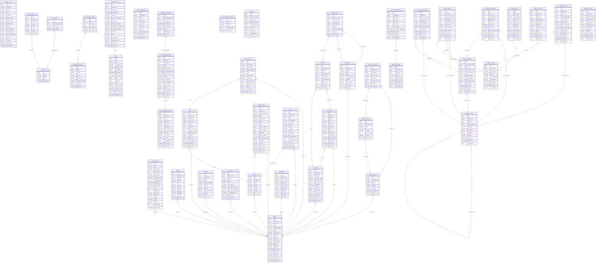

# Supabase Database Schema (ERD Map)

This diagram is automatically generated from the active Supabase database schema.

> **Source:** Generated via **Local SQL Migrations** on 5/18/2026

```mermaid
erDiagram
    ingestion_queue {
        uuid id
        varchar file_path
        varchar slug
        varchar qid
        varchar realm
        varchar realm_guess
        varchar realm_slug
        varchar mime_type
        varchar file_ext
        varchar content_hash
        varchar extracted_text
        numeric route_confidence
        varchar status
        jsonb meta
        timestamp created_at
        timestamp updated_at
    }
    user_profiles {
        uuid id
        uuid active_tenant_id
        varchar full_name
        timestamp updated_at
    }
    tenants {
        uuid id
        varchar name
        varchar slug
        timestamp created_at
    }
    tenant_members {
        uuid id
        uuid tenant_id
        uuid user_id
        varchar email
        public role
        public status
        timestamp created_at
    }
    profiles {
        uuid id
        varchar role
        varchar full_name
        varchar avatar_url
        jsonb metadata
        timestamp created_at
        timestamp updated_at
        uuid id
        uuid user_id
        varchar role
        varchar full_name
        varchar avatar_url
        timestamp created_at
        timestamp updated_at
    }
    app_module_registry {
        uuid id
        varchar slug
        varchar name
        varchar icon
        varchar description
        boolean default_enabled
        serial order_int
        timestamp created_at
    }
    user_module_settings {
        uuid id
        uuid user_id
        uuid module_id
        boolean is_enabled
        timestamp created_at
    }
    elimination_logs {
        uuid id
        uuid patient_id
        varchar event_type
        timestamp occurred_at
        varchar amount
        varchar bowel_consistency
        varchar urine_color
        varchar pain_or_burning
        boolean accident_or_incontinence
        varchar assistance_needed
        varchar location
        varchar notes
        varchar created_by
        jsonb metadata_json
        timestamp created_at
        timestamp updated_at
    }
    checklist_templates {
        uuid id
        uuid patient_id
        varchar title
        varchar category
        boolean is_active
        int version
        varchar notes
        jsonb metadata_json
        timestamp created_at
        timestamp updated_at
    }
    checklist_items {
        uuid id
        varchar label
        varchar description
        int sort_order
        boolean is_required
        varchar default_status
        jsonb metadata_json
        timestamp created_at
        timestamp updated_at
        uuid id
        uuid matter_id
        varchar category
        varchar label
        boolean done
        varchar notes
        int sort_order
        timestamp created_at
    }
    care_schedule_templates {
        uuid id
        uuid patient_id
        varchar title
        varchar category
        varchar description
        time default_time
        varchar recurrence_rule
        varchar priority
        boolean is_active
        varchar notes
        jsonb metadata_json
        timestamp created_at
        timestamp updated_at
    }
    scheduled_care_tasks {
        uuid id
        uuid patient_id
        uuid template_id
        varchar title
        timestamp scheduled_for
        timestamp due_window_start
        timestamp due_window_end
        varchar status
        timestamp completed_at
        varchar completed_by
        varchar skip_reason
        varchar notes
        jsonb metadata_json
        timestamp created_at
        timestamp updated_at
    }
    checklist_completions {
        uuid id
        uuid scheduled_task_id
        varchar completed_by
        timestamp completed_at
        varchar overall_status
        varchar notes
        jsonb metadata_json
        timestamp created_at
    }
    checklist_item_completions {
        uuid id
        varchar status
        varchar notes
        jsonb metadata_json
        timestamp created_at
    }
    matter {
        uuid id
        uuid user_id
        varchar title
        varchar case_number
        varchar court
        varchar jurisdiction
        varchar judge
        varchar plaintiff
        varchar defendant
        varchar status
        varchar phase
        timestamp opened_at
        timestamp trial_date
        varchar notes
        timestamp created_at
        timestamp updated_at
    }
    parties {
        uuid id
        uuid matter_id
        varchar name
        varchar role
        varchar org
        varchar email
        varchar phone
        varchar address
        varchar notes
        timestamp created_at
    }
    issues {
        uuid id
        uuid matter_id
        varchar title
        varchar type
        varchar status
        varchar notes
        timestamp created_at
    }
    facts {
        uuid id
        uuid matter_id
        varchar statement
        varchar category
        varchar status
        uuid issue_id
        uuid source_doc_id
        uuid source_file_id
        varchar excerpt
        varchar page_ref
        varchar date_of_fact
        timestamp created_at
        timestamp updated_at
    }
    evidence_items {
        uuid id
        uuid matter_id
        varchar exhibit_number
        varchar title
        varchar description
        varchar type
        varchar status
        uuid source_file_id
        uuid source_doc_id
        uuid issue_id
        varchar date_collected
        varchar chain_of_custody
        varchar objections
        varchar notes
        boolean pre_marked
        timestamp created_at
        timestamp updated_at
    }
    tasks {
        uuid id
        uuid matter_id
        varchar title
        varchar description
        varchar category
        varchar status
        varchar priority
        varchar owner
        varchar due_date
        timestamp completed_at
        uuid related_issue_id
        varchar notes
        timestamp created_at
        timestamp updated_at
    }
    deadlines {
        uuid id
        uuid matter_id
        varchar title
        varchar deadline_date
        varchar type
        varchar status
        boolean court_imposed
        varchar notes
        timestamp created_at
    }
    timeline_events {
        uuid id
        uuid matter_id
        varchar event_date
        varchar date_precision
        varchar title
        varchar description
        varchar category
        uuid source_doc_id
        uuid source_file_id
        uuid fact_id
        varchar significance
        timestamp created_at
    }
    witnesses {
        uuid id
        uuid matter_id
        varchar name
        varchar role
        varchar contact_info
        varchar subpoena_status
        varchar testimony_summary
        varchar credibility_notes
        timestamp created_at
        timestamp updated_at
    }
    file_registry {
        uuid id
        uuid matter_id
        varchar filename
        varchar relative_path
        varchar storage_path
        varchar category
        varchar mime_type
        bigint file_size
        varchar content_hash
        boolean ingested
        timestamp ingested_at
        timestamp created_at
    }
    documents {
        uuid id
        uuid matter_id
        uuid file_id
        varchar title
        varchar doc_type
        varchar doc_date
        varchar author
        varchar recipient
        int page_count
        varchar extracted_text
        varchar summary
        timestamp created_at
        timestamp updated_at
    }
    text_chunks {
        uuid id
        uuid document_id
        uuid file_id
        int chunk_index
        varchar chunk_text
        int page_number
        int char_start
        int char_end
        timestamp created_at
    }
    citations {
        uuid id
        varchar source_type
        uuid source_id
        varchar cited_by_type
        uuid cited_by_id
        varchar excerpt
        varchar page_ref
        real confidence
        timestamp created_at
    }
    entity_nodes {
        uuid id
        uuid matter_id
        varchar label
        varchar type
        varchar canonical_name
        varchar aliases
        varchar source_type
        uuid source_id
        timestamp created_at
    }
    entity_edges {
        uuid id
        uuid from_node_id
        uuid to_node_id
        varchar relationship
        real weight
        uuid source_chunk_id
        varchar notes
        timestamp created_at
    }
    agent_sessions {
        uuid id
        uuid matter_id
        varchar title
        varchar mode
        varchar status
        timestamp created_at
        timestamp updated_at
    }
    agent_messages {
        uuid id
        uuid session_id
        varchar role
        varchar content
        int token_count
        varchar model
        timestamp created_at
    }
    agent_context_items {
        uuid id
        uuid session_id
        uuid message_id
        varchar source_type
        uuid source_id
        real relevance_score
        boolean included
        timestamp created_at
    }
    matter_links {
        uuid id
        uuid matter_id
        varchar source_type
        uuid source_id
        varchar target_type
        uuid target_id
        varchar link_type
        jsonb metadata
        timestamp created_at
    }
    evidence_records {
        uuid id
        uuid tenant_id
        uuid case_id
        uuid parent_record_id
        varchar file_path
        varchar file_hash
        jsonb metadata
        varchar status
        timestamp created_at
        timestamp updated_at
        uuid created_by
    }
    evidence_segments {
        uuid id
        uuid source_record_id
        uuid tenant_id
        interval start_timestamp
        interval end_timestamp
        int page_number
        varchar segment_type
        varchar content_summary
        jsonb raw_data
        timestamp created_at
        timestamp updated_at
        uuid created_by
    }
    evidence_entities {
        uuid id
        uuid tenant_id
        varchar entity_type
        varchar name
        varchar canonical_id
        jsonb metadata
        timestamp created_at
        timestamp updated_at
        uuid created_by
    }
    evidence_entity_mentions {
        uuid id
        uuid entity_id
        uuid source_record_id
        uuid segment_id
        uuid tenant_id
        qievidence inference
        qievidence confidence
        varchar uncertainty_notes
        timestamp created_at
        timestamp updated_at
        uuid created_by
    }
    evidence_events {
        uuid id
        uuid tenant_id
        uuid case_id
        uuid source_record_id
        uuid segment_id
        varchar event_type
        timestamp event_timestamp
        interval relative_timestamp
        varchar description
        jsonb metadata
        timestamp created_at
        timestamp updated_at
        uuid created_by
    }
    evidence_claims {
        uuid id
        uuid tenant_id
        uuid source_record_id
        uuid segment_id
        uuid claimant_entity_id
        varchar claim_text
        boolean is_contested
        qievidence confidence
        timestamp created_at
        timestamp updated_at
        uuid created_by
    }
    evidence_observations {
        uuid id
        uuid tenant_id
        uuid source_record_id
        uuid segment_id
        varchar observation_text
        varchar observation_type
        jsonb metadata
        timestamp created_at
        timestamp updated_at
        uuid created_by
    }
    evidence_links {
        uuid id
        uuid tenant_id
        varchar source_type
        uuid source_id
        varchar target_type
        uuid target_id
        varchar link_type
        varchar description
        timestamp created_at
        timestamp updated_at
        uuid created_by
    }
    evidence_conflicts {
        uuid id
        uuid tenant_id
        uuid case_id
        varchar conflict_type
        varchar description
        varchar severity
        uuid[] evidence_link_ids
        varchar status
        timestamp created_at
        timestamp updated_at
        uuid created_by
    }
    evidence_timelines {
        uuid id
        uuid tenant_id
        uuid case_id
        varchar name
        varchar description
        timestamp created_at
        timestamp updated_at
        uuid created_by
    }
    evidence_timeline_items {
        uuid id
        uuid timeline_id
        uuid tenant_id
        varchar item_type
        uuid item_id
        int sort_order
        timestamp overridden_timestamp
        timestamp created_at
        timestamp updated_at
        uuid created_by
    }
    evidence_reviews {
        uuid id
        uuid tenant_id
        varchar reference_type
        uuid reference_id
        uuid reviewer_id
        varchar review_notes
        varchar resolution
        varchar status
        timestamp created_at
        timestamp updated_at
        uuid created_by
    }
    user_profiles }o--|| tenants : "active_tenant_id"
    tenant_members }o--|| tenants : "tenant_id"
    user_module_settings }o--|| profiles : "user_id"
    user_module_settings }o--|| app_module_registry : "module_id"
    checklist_items }o--|| matter : "matter_id"
    scheduled_care_tasks }o--|| care_schedule_templates : "template_id"
    checklist_completions }o--|| scheduled_care_tasks : "scheduled_task_id"
    parties }o--|| matter : "matter_id"
    issues }o--|| matter : "matter_id"
    facts }o--|| matter : "matter_id"
    facts }o--|| issues : "issue_id"
    evidence_items }o--|| matter : "matter_id"
    evidence_items }o--|| issues : "issue_id"
    tasks }o--|| matter : "matter_id"
    tasks }o--|| issues : "related_issue_id"
    deadlines }o--|| matter : "matter_id"
    timeline_events }o--|| matter : "matter_id"
    timeline_events }o--|| facts : "fact_id"
    witnesses }o--|| matter : "matter_id"
    file_registry }o--|| matter : "matter_id"
    documents }o--|| matter : "matter_id"
    documents }o--|| file_registry : "file_id"
    text_chunks }o--|| documents : "document_id"
    text_chunks }o--|| file_registry : "file_id"
    entity_nodes }o--|| matter : "matter_id"
    entity_edges }o--|| entity_nodes : "from_node_id"
    entity_edges }o--|| entity_nodes : "to_node_id"
    entity_edges }o--|| text_chunks : "source_chunk_id"
    agent_sessions }o--|| matter : "matter_id"
    agent_messages }o--|| agent_sessions : "session_id"
    agent_context_items }o--|| agent_sessions : "session_id"
    agent_context_items }o--|| agent_messages : "message_id"
    matter_links }o--|| matter : "matter_id"
    evidence_records }o--|| evidence_records : "parent_record_id"
    evidence_segments }o--|| evidence_records : "source_record_id"
    evidence_entity_mentions }o--|| evidence_entities : "entity_id"
    evidence_entity_mentions }o--|| evidence_records : "source_record_id"
    evidence_entity_mentions }o--|| evidence_segments : "segment_id"
    evidence_events }o--|| evidence_records : "source_record_id"
    evidence_events }o--|| evidence_segments : "segment_id"
    evidence_claims }o--|| evidence_records : "source_record_id"
    evidence_claims }o--|| evidence_segments : "segment_id"
    evidence_claims }o--|| evidence_entities : "claimant_entity_id"
    evidence_observations }o--|| evidence_records : "source_record_id"
    evidence_observations }o--|| evidence_segments : "segment_id"
    evidence_timeline_items }o--|| evidence_timelines : "timeline_id"

```
