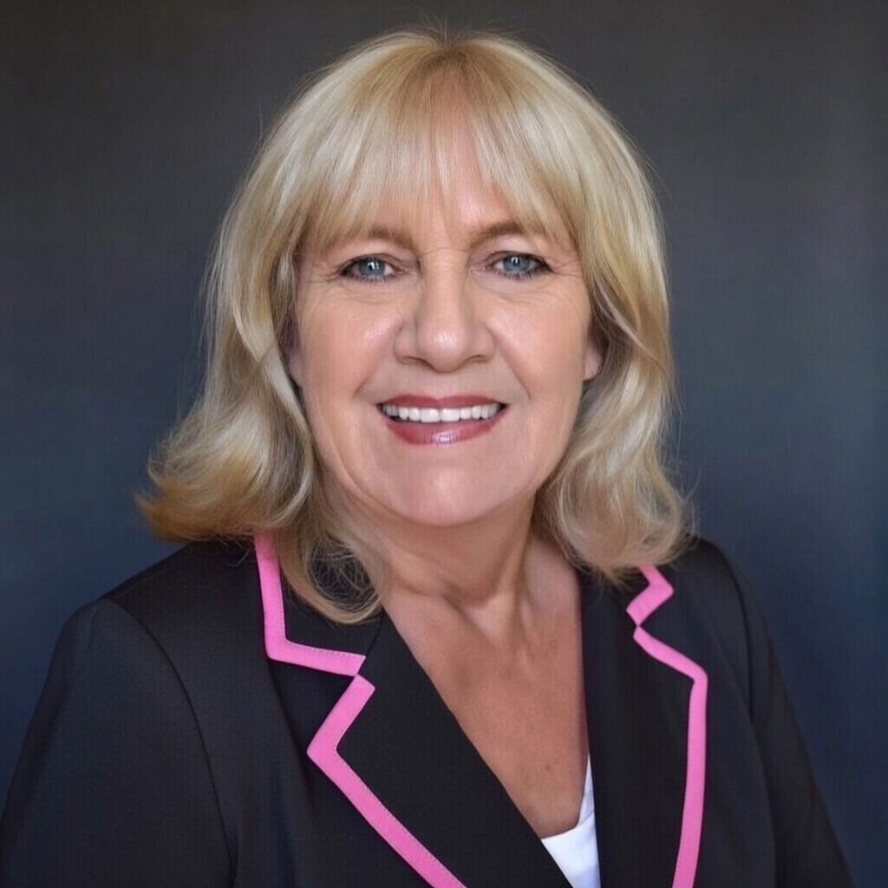

# Back Matter

**Lisa English** (Cody "Q" Rice-Velasquez) is a storyteller, survivor, and advocate. From the neon lights of the club to the boardrooms of power, she has lived a life of transformation. "Paid In Full" is the raw, unfiltered account of that journey—a testament to resilience and the refusal to be defined by one's past.

<section style="margin-top: 10%; text-align: center; padding: 0 1rem;">

In the shadows of the "Busybody," a girl named Lisa disappeared, and a woman named "Madam" was born. But even the darkest nights end.

This is not just a memoir; it's a map out of hell. It's for anyone who has ever sold a piece of themselves to survive, anyone who has looked in the mirror and seen a stranger.

 

It's time to settle the debts. It's time to be Paid In Full.

</section>
